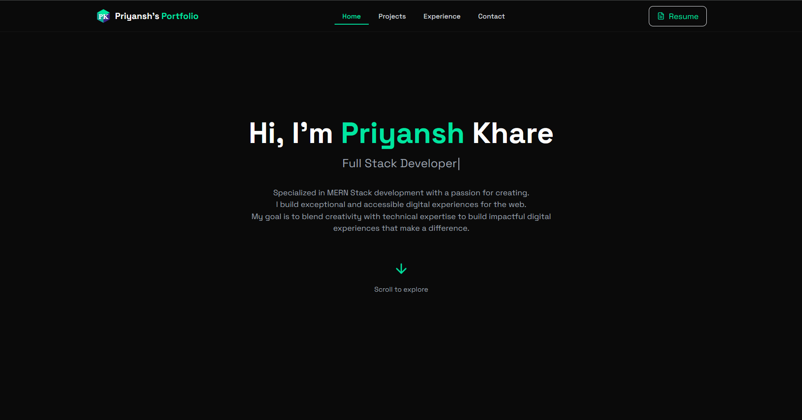

# Priyansh's Portfolio

A modern, responsive portfolio website built with React, TypeScript, and Node.js. Features smooth animations, visitor tracking, admin dashboard, and multi-language support.



## 🌟 Features

- **Modern UI/UX**
  - Smooth scroll animations
  - Interactive components
  - Responsive design
  - Custom theme with glass morphism effects
  - Dynamic typewriter effect

- **Admin Dashboard**
  - Visitor tracking analytics
  - User interaction monitoring
  - Contact form submissions
  - Secure authentication

- **Technical Features**
  - Server-side tracking
  - MongoDB integration
  - JWT authentication
  - Rate limiting
  - CORS protection
  - Responsive images
  - SEO optimized

## 🚀 Tech Stack

### Frontend
- React.js
- TypeScript
- Tailwind CSS
- Framer Motion
- React Router
- Axios
- i18next

### Backend
- Node.js
- Express.js
- MongoDB
- JWT
- Bcrypt
- Helmet
- CORS

## 🛠️ Installation & Setup

1. Clone the repository
```bash
git clone https://github.com/PriyanshK09/Portfolio-Priyansh.git
cd Portfolio-Priyansh
```

2. Install dependencies for both frontend and backend
```bash
# Install frontend dependencies
npm install

# Install backend dependencies
cd server
npm install
```

3. Create a .env file in the root directory:
```env
NODE_ENV=development
FRONTEND_URL=http://localhost:3000
VITE_API_URL=http://localhost:5000
MONGODB_URI=your_mongodb_uri
JWT_SECRET=your_jwt_secret
ADMIN_PASSWORD_HASH=your_hashed_password
PORT=5000
```

4. Start the development servers
```bash
# Start frontend (in root directory)
npm run dev

# Start backend (in /server directory)
npm run server
```

## 📦 Project Structure

```
Portfolio-Priyansh/
├── src/
│   ├── components/     # React components
│   ├── pages/         # Page components
│   ├── data/          # Static data
│   ├── types/         # TypeScript types
│   └── i18n/          # Internationalization
├── server/
│   ├── models/        # MongoDB models
│   ├── routes/        # API routes
│   ├── middleware/    # Custom middleware
│   └── index.js       # Server entry point
└── public/            # Static assets
```

## 🔐 Admin Dashboard

Access the admin dashboard at `/admin` with the following features:
- Visitor analytics
- User interaction tracking
- Message management
- Real-time statistics

## 🌐 Deployment

The website is deployed using:
- Frontend: [Netlify](https://priyanshk.netlify.app/)

## 📝 License

This project is licensed under the MIT License - see the LICENSE file for details.

## 👨‍💻 Author

**Priyansh Khare**
- Github: [@PriyanshK09](https://github.com/PriyanshK09)
- LinkedIn: [priyanshk09](https://www.linkedin.com/in/priyanshk09/)
- Email: mrpriyanshuniverse@gmail.com

## 🙏 Acknowledgments

- [Lucide Icons](https://lucide.dev/) for beautiful icons
- [Framer Motion](https://www.framer.com/motion/) for smooth animations
- [Tailwind CSS](https://tailwindcss.com/) for styling